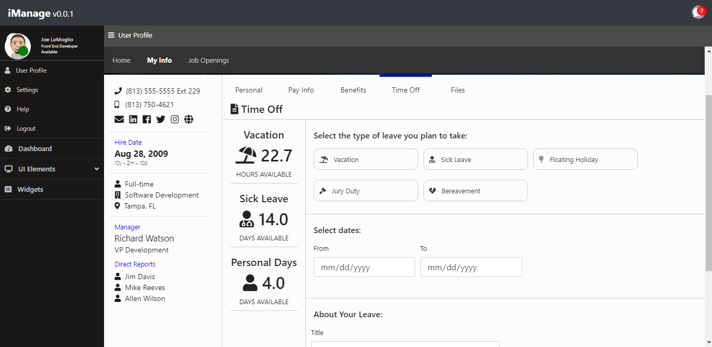

# iManage 

This is a project I created to learn react. Its an Enterprise Development Team Managent Tool and Comapny Portal.

The project is built on React v16.8 with MobX for state management and Styled-Components
for CSS/SASS. I plan to build out the backend with MongoDB, Express and Node.

This is an ongoing project that only serves to continue to improve my full-stack MERN development skills.

## I will be doing a build and launching a Github page on 4/28/2019.

